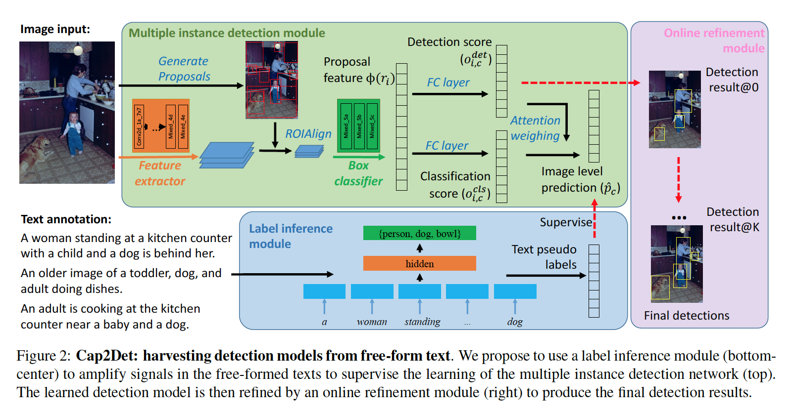

# Cap2Det

  * [Introduction](introduction)
  * [TL;DR](#tldr)
  * [Installation](#installation)
  * [Preparing data](#preparing-data)
    -  [Pascal VOC](#pascal-voc)
    -  [MSCOCO 2017](#mscoco-2017)
    -  [Flickr30K](#flickr30k)
  * [Training](#training)
    -  [Pre-training of a text model](#pre-training-of-a-text-model)
    -  [Cap2Det training](#cap2det-training)
  * [Our paper](#our-paper)

## Introduction

Implementation of our ICCV 2019 paper "[Cap2Det: Learning to Amplify Weak Caption Supervision for Object Detection](https://arxiv.org/abs/1907.10164)".



## TL;DR

Here are the simplest commands for preparing the data and training the models.
One can skip all the rest of the contents in this document.

```
sh dataset-tools/download_and_preprocess_voc.sh "raw-data-voc"
sh dataset-tools/download_and_preprocess_mscoco.sh "raw-data-coco"
sh dataset-tools/download_and_preprocess_flickr30k.sh "raw-data-flickr30k/"

# Train a text classifier.
sh train_text.sh "coco17_text"

# Train a Cap2Det model.
sh train_cap2det.sh "coco17_extend_match"

# Train a WSOD model.
sh train_wsod.sh "voc07_groundtruth"
```

Please read the following details regarding the usage.


## Installation

We use Python 3.6.4 and Tensorflow 1.10.1.
More details regarding the required packages can be found in [requirements.txt](requirements.txt).

To install the packages using the default setting, one can use pip:

```
pip install -r "requirements.txt"
```

## Preparing data

We provide scripts to preprocess datasets such as Pascal VOC 2007/2012, MSCOCO 2017, Flick30K, Image Ads.

Preparing these datasets involves three steps:

*  Extract region proposals using the Selective Search algorithm.
*  Encode the annotations and the region proposals to the tfrecord files.
*  Gather the open vocabulary, extract required word embeddings from pre-trained GloVe model.

### Pascal VOC

The Pascal VOC datasets are used for:

*  Validating the Weakly Supervised Object Detection (WSOD) models.
*  Validating our Cap2Det models.

The datasets do not have captions annotations.

For the first goal (WSOD), we tested our models on both VOC2007 and VOC2012.
we train on 5,011 and 11,540 trainval images respectively,
We evaluate on 4,952 and 10,991 test images.

For the second goal (Cap2Det),
we train models on MSCOCO or Flickr30k, then evaluate on the 4,952 test images in VOC2007.

```
python "dataset-tools/create_pascal_selective_search_data.py" \
  --logtostderr \
  --data_dir="${DATA_DIR}" \
  --year="${YEAR}" \
  --set="${SET}" \
  --output_dir="${OUTPUT_DIR}"

python "dataset-tools/create_pascal_tf_record.py" \
  --logtostderr \
  --data_dir="${DATA_DIR}" \
  --year="${YEAR}" \
  --set="${SET}" \
  --output_path="${OUTPUT_PATH}" \
  --label_map_path="${LABEL_MAP_PATH}" \
  --proposal_data_path="${PROPOSAL_DATA_PATH}" \
  --ignore_difficult_instances
```

* All-in-one

Putting all together, one can just run the following all-in-one command.
It shall create a new raw-data-voc directory, and generate files in it.

```
sh dataset-tools/download_and_preprocess_voc.sh "raw-data-voc"
```

### MSCOCO 2017

We use the 591,435 annotated captions paired to the 118,287 train2017 images for training our Cap2Det model.
The evaluation is proceeded on either the MSCOCO test images or the 4,952 VOC2007 images.

```
python "dataset-tools/create_coco_selective_search_data.py" \
  --logtostderr \
  --train_image_file="${TRAIN_IMAGE_FILE}" \
  --val_image_file="${VAL_IMAGE_FILE}" \
  --test_image_file="${TEST_IMAGE_FILE}" \
  --train_annotations_file="${TRAIN_ANNOTATIONS_FILE}" \
  --val_annotations_file="${VAL_ANNOTATIONS_FILE}" \
  --testdev_annotations_file="${TESTDEV_ANNOTATIONS_FILE}" \
  --output_dir="${OUTPUT_DIR}"

python "dataset-tools/create_coco_tf_record.py" \
  --logtostderr \
  --train_image_file="${TRAIN_IMAGE_FILE}" \
  --val_image_file="${VAL_IMAGE_FILE}" \
  --test_image_file="${TEST_IMAGE_FILE}" \
  --train_annotations_file="${TRAIN_ANNOTATIONS_FILE}" \
  --train_caption_annotations_file="${TRAIN_CAPTION_ANNOTATIONS_FILE}" \
  --val_annotations_file="${VAL_ANNOTATIONS_FILE}" \
  --val_caption_annotations_file="${VAL_CAPTION_ANNOTATIONS_FILE}" \
  --testdev_annotations_file="${TESTDEV_ANNOTATIONS_FILE}" \
  --proposal_data="${PROPOSAL_DATA}" \
  --output_dir="${OUTPUT_DIR}"

python "dataset-tools/create_coco_vocab.py" \
  --logtostderr \
  --train_caption_annotations_file="${TRAIN_CAPTION_ANNOTATIONS_FILE}" \
  --glove_file="${GLOVE_FILE}" \
  --output_vocabulary_file="${OUTPUT_VOCABULARY_FILE}" \
  --output_vocabulary_word_embedding_file="${OUTPUT_VOCABULARY_WORD_EMBEDDING_FILE}" \
  --min_word_freq=${MIN_WORD_FREQ}
```

* All-in-one

Putting all together, one can just run the following all-in-one command.
It shall create a new raw-data-coco directory, and generate files in it.

```
sh dataset-tools/download_and_preprocess_mscoco.sh "raw-data-coco/"
```

### Flickr30K

We also trained a Cap2Det model on the FLickr30K dataset containing 31,783 images and 158,915 descriptive captions.

```
python "dataset-tools/create_flickr30k_selective_search_data.py" \
  --logtostderr \
  --image_tar_file=${IMAGE_TAR_FILE} \
  --output_dir=${OUTPUT_DIR}

python "create_flickr30k_tf_record.py" \
  --logtostderr \
  --image_tar_file="${IMAGE_TAR_FILE}" \
  --proposal_data_path="${PROPOSAL_DATA_PATH}" \
  --annotation_path="${ANNOTATION_PATH}" \
  --output_path="${OUTPUT_PATH}"

python "create_flickr30k_vocab.py" \
  --logtostderr \
  --annotation_path="${ANNOTATION_PATH}" \
  --glove_file="${GLOVE_FILE}" \
  --output_vocabulary_file="${OUTPUT_VOCABULARY_FILE}"
  --output_vocabulary_word_embedding_file="${OUTPUT_VOCABULARY_WORD_EMBEDDING_FILE}"
```

* All-in-one

Putting all together, one can just run the following all-in-one command.
It shall create a new raw-data-flickr30k directory, and generate files in it.

```
sh dataset-tools/download_and_preprocess_flickr30k.sh "raw-data-flickr30k/"
```

## Training

### Pre-training of a text model

The following command shall launch a process to train the text classifier, which is a 3-layers perceptron model.
```
sh train_text.sh "coco17_text"
```

### Cap2Det training

The difference between the Weakly Supervised Object Detection (WSOD) and Caption-to-Detection (Cap2Det) models, lies in the way of extracting the labels.

We defined abstract [LabelExtractor](models/label_extractor.py) class to control the behavior of label extractors.
The following tables show how to set the configure to reproduce the methods in the paper.

| Name                         | Alternative methods in the paper | Configure files                                                                                              |
|------------------------------|----------------------------------|--------------------------------------------------------------------------------------------------------------|
| GroundtruthExtractor         | GT-Label (WSOD)                  | [coco17_groundtruth](configs/coco17_groundtruth.pbtxt), [voc07_groundtruth](configs/voc07_groundtruth.pbtxt) |
| ExactMatchExtractor          | ExactMatch (EM)                  | [coco17_exact_match](configs/coco17_exact_match.pbtxt)                                                       |
| ExtendMatchExtractor         | EM+ExtendVocab                   | [coco17_extend_match](configs/coco17_extend_match.pbtxt)                                                     |
| WordVectorMatchExtractor     | EM+GloVePseudo, EM+LearnedGloVe  | [coco17_word_vector_match](configs/coco17_word_vector_match.pbtxt)                                           |
| TextClassifierMatchExtractor | EM+TextClsf                      | [coco17_text_classifier_match](configs/coco17_text_classifier_match)                                         |

The command to launch the training process is 

```
sh train_cap2det.sh "[CONFIG_NAME]"

# or

sh train_wsod.sh "[CONFIG_NAME]"
```

Where the [CONFIG_NAME] can be one of the file names in the [configs](configs) directory.

## Our paper

If you found this repository useful, please cite our paper

```
@InProceedings{Ye_2019_ICCV,
  author = {Ye, Keren and Zhang, Mingda and Kovashka, Adriana and Li, Wei and Qin, Danfeng and Berent, Jesse},
  title = {Cap2Det: Learning to Amplify Weak Caption Supervision for Object Detection},
  booktitle = {The IEEE International Conference on Computer Vision (ICCV)},
  month = {Oct},
  year = {2019}
}
```
